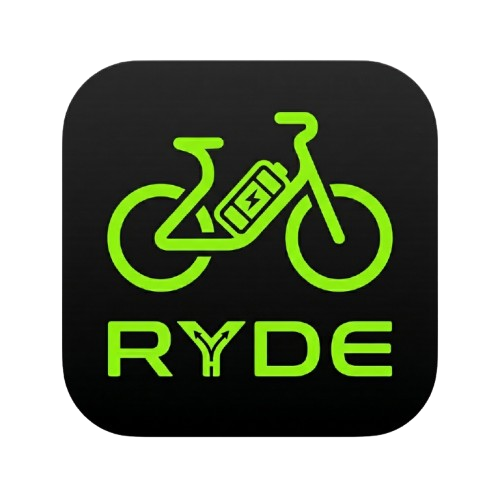

# MyRyde 
O app MyRyde é um aplicativo mobile para gestão pessoal de autonomia de bicicletas elétricas, criado para uso cotidiano para calcular o consumo de bateria durante os trajetos cadastrados

---

# Funcionamento
- O usuário cadastra as rotas que costuma fazer em sua cidade, inserindo nome da rota e consumo de bateria.
- Informa a bateria atual da bicicleta e seleciona a rota que deseja fazer para que o app calcule o consumo
- O código calcula quantos % de bateria aquele trajeto vai consumir e alerta o usuário se vai zerar a bateria ou chegar próxima de zero
- Permite o usuário exportar o banco de dados via arquivo .json e importar também, para uso em múltiplos aparelhos

